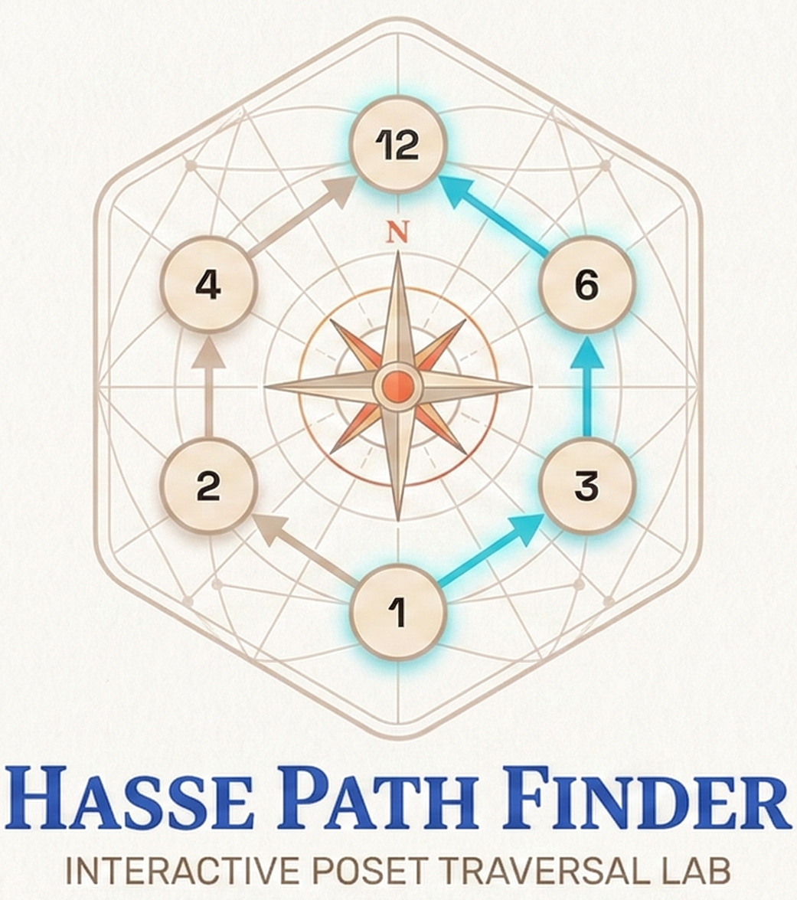

# Hasse Path Finder

Interactive Poset Traversal Lab for learning Hasse diagrams, BFS, and DFS through visual simulation.



## Overview
Hasse Path Finder is a browser-based educational tool that helps users:
- build and validate relation-based posets,
- generate a Hasse diagram,
- run BFS/DFS traversals between selected nodes,
- understand traversal behavior step-by-step.

It is designed to be beginner-friendly while still being technically correct for academic use.

## Key Features
- Relation input and parsing from set/pair format
- Poset proof checks:
  - Reflexive
  - Antisymmetric
  - Transitive
- Automatic Hasse diagram construction from valid relations
- BFS and DFS traversal visualization
- Step Mode for guided learning with per-step explanations
- Speed control for traversal animation
- Start/End node mode selection and clear controls
- Drag, pan, zoom graph interaction
- Undo/Redo for node movement (Ctrl+Z / Ctrl+Y)
- Traversal log modal
- PNG export of graph
- Project assets page for presentation and report viewing

## Tech Stack
- HTML5
- CSS3
- JavaScript (ES Modules)
- D3.js (graph rendering and interactions)

## Project Structure
```text
PFS/
|- index.html
|- styles.css
|- project-assets.html
|- ProjectPresentation.pptx
|- ProjectReport.pdf
|- ProjectReport.docx
|- Presentation_Slides_Content.md
|- Project_Report_15_Pages.md
|- README.md
|- logo/
|  |- Logo.png
|  |- LogoCircle.png
|  |- LogowithName.png
|- js/
   |- main.js
   |- ui.js
   |- graph.js
   |- data.js
   |- algorithms.js
   |- export.js
```

## Getting Started

### Prerequisites
- Any modern browser (Chrome, Edge, Firefox)
- A local static web server (recommended for ES module loading)

### Run Locally
Option 1 (VS Code):
- Open the folder in VS Code
- Use Live Server on [index.html](index.html)

Option 2 (Python):
```bash
python -m http.server 8000
```
Then open:
- http://localhost:8000/index.html

## How to Use
1. Open the simulator at [index.html](index.html).
2. Use Relation S / Poset to:
   - enter elements and relation pairs, or
   - generate by rule (for example: `x | y`).
3. Apply relation and verify proof output.
4. Select Start and End nodes in the graph.
5. Run BFS or DFS.
6. Use Step Mode for guided traversal learning.
7. Export diagram as PNG if needed.
8. Open Present to access [project-assets.html](project-assets.html).

## Documentation
- Presentation content (Markdown): [Presentation_Slides_Content.md](Presentation_Slides_Content.md)
- Detailed report (15-page structure): [Project_Report_15_Pages.md](Project_Report_15_Pages.md)

## Team
- MahirShah07
- Rumani07

Guided by:
- Dr. Ashlesha Bhise

## Future Improvements
- Add more algorithms (for example, topological sorting, shortest path variants)
- Add quiz/assessment mode for students
- Improve large-graph layout strategies
- Add downloadable proof report format

## License
This project is licensed under the MIT License.
See [LICENSE](LICENSE) for details.
